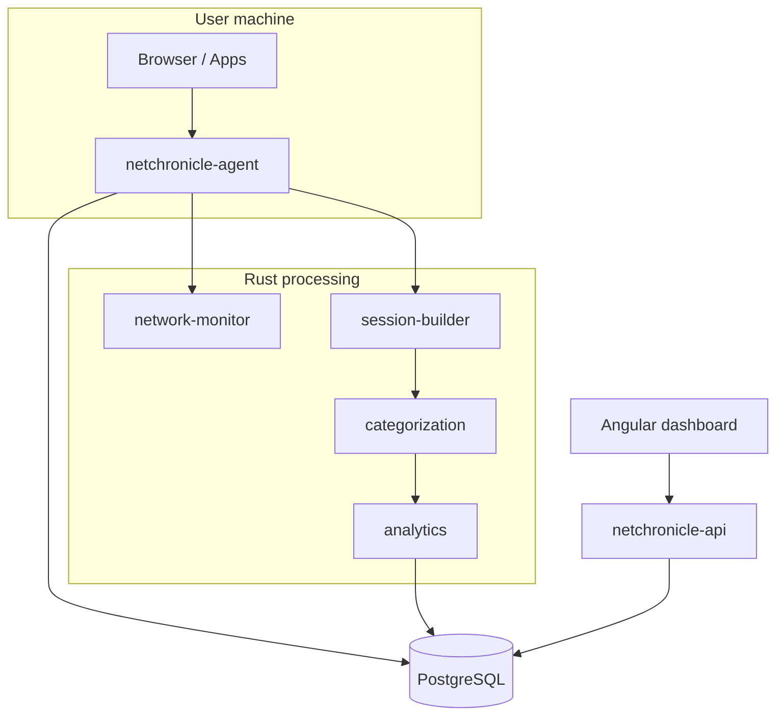

# NetChronicle Architecture

## Data flow

## Crate responsibilities

| Crate | Role |
|-------|------|
| `agent` | Background collector; writes `raw_events`, triggers pipelines |
| `network-monitor` | Samples latency, loss, bandwidth |
| `session-builder` | Groups events into `sessions` |
| `categorization` | Applies rules to domains/apps |
| `analytics` | Scores and `insights` |
| `db` | SQLx pool, migrations, repositories |
| `api` | Axum REST surface for the dashboard |
| `common` | Shared serde types |

## Dashboard routes

| Route | Plan section |
|-------|----------------|
| `/` | Today summary + live strip |
| `/timeline` | Timeline view |
| `/network` | Network monitoring panel (soon) |
| `/analytics` | Charts (soon) |
| `/insights` | Insights panel (soon) |
| `/reports` | Reports (soon) |
| `/live` | Live mode |
| `/settings` | Settings (soon) |
