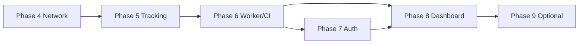

# NetChronicle — Phase-Wise Implementation Plan

> **Scope:** Remaining work from the current `main` baseline through a production-ready local product (backend + dashboard).
>
> **Last updated:** July 2026

---

## Status at a glance

| Phase | Name | Status |
|-------|------|--------|
| 0 | Foundation | ✅ Done |
| 1 | Stabilize core pipeline | ✅ Done |
| 2 | Sessions & analytics | ✅ Done (with known gaps) |
| 3 | Tracking & categorization | ✅ Mostly done (extension missing) |
| **4** | **Real network metrics** | ✅ Done (this branch) |
| **5** | **Tracking completeness** | ⬜ Planned |
| **6** | **Workers, reports & hardening** | ⬜ Planned |
| **7** | **Auth, settings & privacy** | ⬜ Planned |
| **8** | **Dashboard (Next.js)** | ⬜ Planned |
| **9** | **Optional extensions** | ○ Later |

**Recommended next step:** Phase 5 — browser extension + session/website linking.

---

## What’s already shipped (Phases 0–3)

Do not re-implement these unless fixing bugs.

| Area | Evidence |
|------|----------|
| Schema + DB repos | `migrations/001_initial_schema.sql`, `crates/db` |
| Agent → Postgres pipeline | `crates/agent` (window tracking, flush, live snapshot) |
| Session builder + background rebuild | `crates/session-builder`, `crates/agent/src/session_job.rs` |
| Analytics engine | `crates/analytics` → `/daily-report`, `/weekly-report`, `/insights` |
| Category rules CRUD + agent refresh | API + `rules_cache` |
| Windows idle detection | `crates/agent/src/idle.rs` |
| Browser feed HTTP server | `crates/agent/src/browser_feed.rs` (port `9477`) |
| API docs + README | `docs/api.md`, `README.md` |

### Known gaps left from earlier phases

These are folded into Phases 5–6 rather than reopening 2–3:

- Session rebuild only covers **today**
- `website_logs` are cleared of `session_id` but **not re-linked** after rebuild
- Insights are shallow (no strong time-of-day / network narrative)
- Browser URLs still rely on **title heuristics** without an extension
- Non-Windows idle is a no-op
- Almost no tests / no CI

---

## Phase 4 — Real network metrics

**Goal:** Deliver the network + productivity differentiator.

**Effort:** 1–2 weeks  
**Primary crates:** `network-monitor`, `agent`, `analytics`, `api`, `db`

### Tasks

1. **Replace TCP-only probe**
   - ICMP ping (platform-specific; document Windows admin/raw-socket needs)
   - Packet loss over N pings per sample
   - Optional HTTP download for bandwidth estimate (`bandwidth_mbps`)
   - Keep TCP connect as fallback when ICMP is unavailable

2. **Disconnect / adapter detection**
   - Detect adapter down / no default route
   - Persist `disconnect = true` samples with timestamps

3. **Session correlation**
   - During session build, classify window as `stable | degraded | unstable | offline`
   - Write `network_stability` on `sessions`

4. **API**
   - `GET /network-stats?from=&to=` — aggregated avg / p95 latency, loss %, sample count
   - `GET /network-events` — disconnects and spike windows
   - Align response shape with `docs/api.md`

5. **Insights**
   - At least one insight that references network quality during a focus session

### Exit criteria

- [x] Latency + real packet loss stored every sample interval
- [x] Bandwidth column populated when probe supports it
- [x] Sessions have non-null `network_stability` when samples exist
- [x] `/insights` can mention network degradation
- [x] Unit tests for probe result mapping and stability classification

**Branch:** `feature/phase-4-network`

---

## Phase 5 — Tracking completeness

**Goal:** Accurate activity data — exact URLs, correct idle, correct session linkage.

**Effort:** 1–2 weeks  
**Primary crates:** `agent`, `session-builder`, `db` + new `extension/` (or `apps/extension`)

### Tasks

1. **Browser extension (Phase 3b finish)**
   - Chrome/Edge MV3 extension posting `{ url, title, tabId, active }` to `http://127.0.0.1:9477`
   - Prefer feed URL over title heuristics when fresh
   - Document install + permissions in README

2. **Session rebuild correctness**
   - Rebuild **today + yesterday** (or configurable lookback days)
   - Re-link `website_logs.session_id` after build (mirror `link_app_logs`)
   - Avoid double-counting / orphan sessions

3. **Idle on non-Windows**
   - Linux/macOS stubs with clear behavior (or documented “Windows-only” until implemented)
   - Ensure idle time is excluded from productivity minutes on Windows

4. **App metadata polish**
   - Expand friendly-name map for common apps
   - Optional: store process path / icon hash in `raw_events`

### Exit criteria

- [ ] Top browsers report exact domain/URL via extension when installed
- [ ] Website logs appear under the correct session in `/timeline` and `/sessions`
- [ ] Historical lookback rebuild works for at least 2 days
- [ ] Extension + agent feed documented

---

## Phase 6 — Workers, reports & production hardening

**Goal:** Always-on backend ready for dashboard consumption.

**Effort:** 2–3 weeks  
**Primary crates:** new `crates/worker`, `api`, `analytics`, `db` + CI

### Tasks

1. **`netchronicle-worker` binary**
   - Nightly: rebuild sessions for lookback window
   - Compute/cache daily + weekly (+ monthly) reports in `reports`
   - Prune old `raw_events` per retention env (e.g. 30/90 days)

2. **Reports API**
   - `GET /reports/daily|weekly|monthly`
   - `GET /reports/export?format=json|csv`
   - Keep existing `/daily-report` / `/weekly-report` as aliases or deprecate cleanly

3. **Richer analytics**
   - Time-of-day productivity patterns
   - Distraction impact %
   - Stronger network ↔ focus correlation copy

4. **Testing**
   - Unit: categorization, session-builder, analytics, network stability
   - Integration: API + Postgres (Docker)
   - Agent smoke test with mocked window provider

5. **CI / observability**
   - GitHub Actions: `fmt`, `clippy`, `test`
   - `GET /health` already exists — keep DB check
   - Optional Prometheus `/metrics`

6. **Deployment docs**
   - API on Fly/Railway + Neon
   - Agent as Windows background process / scheduled task notes

### Exit criteria

- [ ] CI green on every PR
- [ ] Reports generated without manual intervention
- [ ] Retention job documented and configurable
- [ ] Workspace test count meaningfully above current (~11)

---

## Phase 7 — Auth, settings & privacy

**Goal:** Multi-user-safe API; agent authenticated; user control over tracking data.

**Effort:** 2 weeks  
**Primary crates:** `api`, `db`, `agent`, `common`

### Tasks

1. **Auth**
   - Simple email/password or local API-key model first
   - JWT (or opaque session) for dashboard
   - Agent uses per-user/device `AGENT_API_KEY`

2. **Settings API**
   - `GET/PATCH /settings` — tracking on/off, intervals, privacy flags
   - Persist in `users.settings` JSONB; agent hot-reloads where possible

3. **Devices**
   - Migration: `devices` (agent_id, user_id, last_seen, name)
   - Scope `GET /live-status` to active device

4. **Privacy**
   - `POST /export` — JSON/CSV dump
   - `DELETE /data` — wipe activity with confirmation token

### Exit criteria

- [ ] Unauthenticated agents cannot write another user’s data
- [ ] Settings change tracking behavior without code changes
- [ ] Export + delete verified against a test user

---

## Phase 8 — Dashboard (Next.js)

**Goal:** First usable UI against the stable API contract.

**Effort:** 2–4 weeks  
**Location:** `apps/dashboard` (referenced by `scripts/dev.ps1` / `.env.example`)

**Prerequisite:** Phases 4–6 preferably done; Phase 7 if multi-user is required.

### Tasks

1. **Scaffold**
   - Next.js app, typed API client from `docs/api.md`
   - Env: `NEXT_PUBLIC_API_URL`

2. **Routes** (from `docs/architecture.md`)

   | Route | Purpose |
   |-------|---------|
   | `/` | Today summary + live status |
   | `/timeline` | Merged app + website day view |
   | `/network` | Latency / loss / disconnects |
   | `/analytics` | Charts (daily/weekly) |
   | `/insights` | Insight cards |
   | `/reports` | Cached reports + export |
   | `/live` | Live mode polling |
   | `/settings` | Tracking + privacy controls |

3. **UX constraints**
   - One job per page; avoid dashboard clutter in the first viewport of marketing pages if any
   - Prefer charts/tables that answer “what did I do / how was my network”

4. **Polish**
   - Loading / empty / error states
   - Date picker wired to `?date=` / `?from=` / `?to=`
   - Optional: system tray later via Tauri (Phase 9)

### Exit criteria

- [ ] All core routes render real API data
- [ ] `scripts/dev.ps1` starts API + agent + dashboard docs match reality
- [ ] Mobile-usable layout for timeline + today view

---

## Phase 9 — Optional extensions (post-MVP)

| Feature | Notes |
|---------|-------|
| DNS-based tracking | Passive domains without extension |
| ML categorization | Learn from user corrections |
| WebSocket live stream | Push instead of poll |
| Tauri / system tray | Desktop shell around agent + UI |
| Team / org accounts | Aggregate across users |
| PDF reports | Only if export demand appears |

---

## Suggested build order

```
Phase 0–3  ✅  Shipped on main
Phase 4    →   Real network metrics          ← start here
Phase 5    →   Extension + session correctness
Phase 6    →   Worker + CI + richer reports
Phase 7    →   Auth + settings + privacy
Phase 8    →   Next.js dashboard
Phase 9    ○   Optional advanced features
```



Parallelism note: Phase 8 can start against a frozen API after Phase 6 if a single local user is enough; insert Phase 7 first when multi-user or remote deploy matters.

---

## Crate / app ownership (remaining work)

| Area | Phases |
|------|--------|
| `network-monitor` | 4 |
| `agent` | 4, 5, 7 |
| `session-builder` / `db` | 5, 6 |
| `analytics` / `api` | 4, 6, 7 |
| `worker` (new) | 6 |
| `extension/` (new) | 5 |
| `apps/dashboard` (new) | 8 |
| `common` | evolves as types need it |

---

## Out of scope (unless explicitly pulled in)

- Mobile apps
- Billing / subscriptions
- PDF UI (until Phase 9 demand)
- Rewriting Phases 0–3 from scratch

---

## Definition of “MVP product complete”

Ship when Phases **4–6** and **8** meet exit criteria:

1. Real latency/loss (and optional bandwidth) correlated to sessions  
2. Accurate browser URLs via extension  
3. Automatic reports + CI  
4. Dashboard showing today, timeline, network, insights  

Phase 7 is required before any shared/cloud multi-user deployment.
